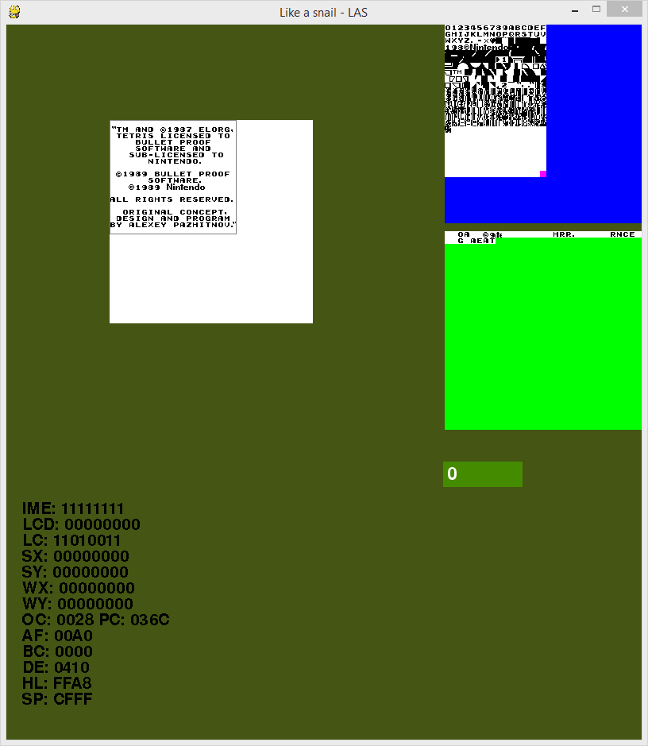

:doctitle: Like a snail - LAS
:xrefstyle: short

= {doctitle}

LAS is another Game Boy emulator written in Python. The challenge is to rely only on Python code without using directly written c code. + 
Currently it has some sort of C code integrated to get a little bit more speed while debugging. +
The main goal is to get it running without any C code and to show how fast / slow it is running in reality.

== Current state

The emulator is able to run trough the Nintendo Logo (Bootloader) and to start e.g.: Tetris and show the first screen, see <<las>>. However, there are a many things to fix and improve. Implementation of test functions and setting up a pipeline is currently the most important goal.

[#las]
.Like a snail - Tetris

== Useage

The project is based on PyDev in Eclipse. +
So checkout the git project in Eclipse and use the main.py in the main package to run LAS.

== Goal

Despite the function overhead which is a kind of problem there are some questions to answer:

* Can we optimize the functions in Python code by using the most efficent functions for each task?
* Is it possible to optimize the emulated hardware task to be more efficent?
* What is the biggest bottleneck?
* Do we have to use C code for every module or is it enough to replace some modules with C code?
* Which benefits the most in speeding it up by C code?
